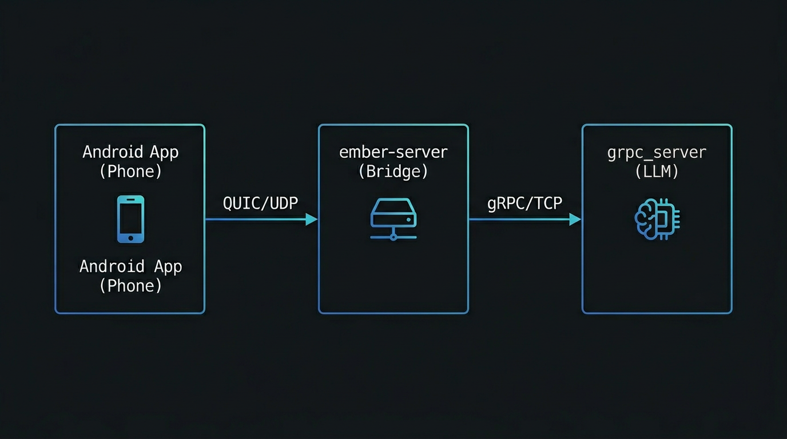
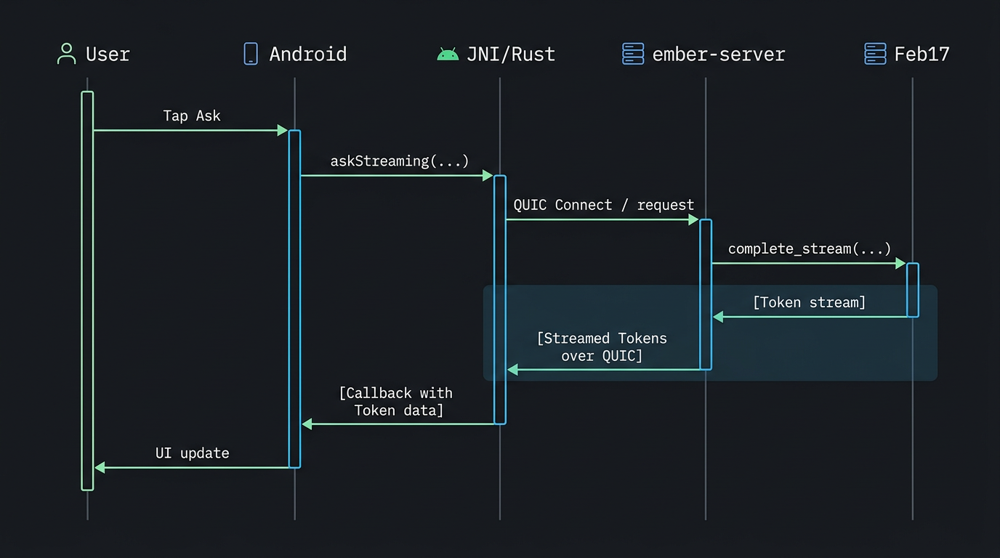
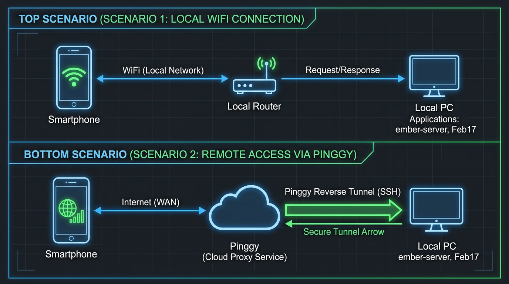
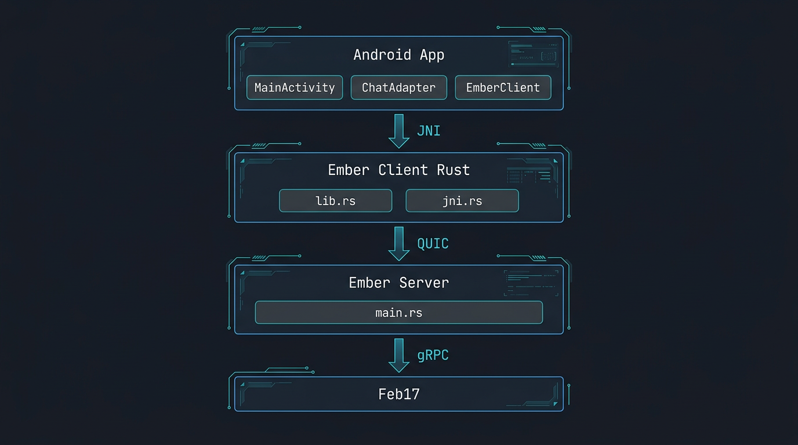
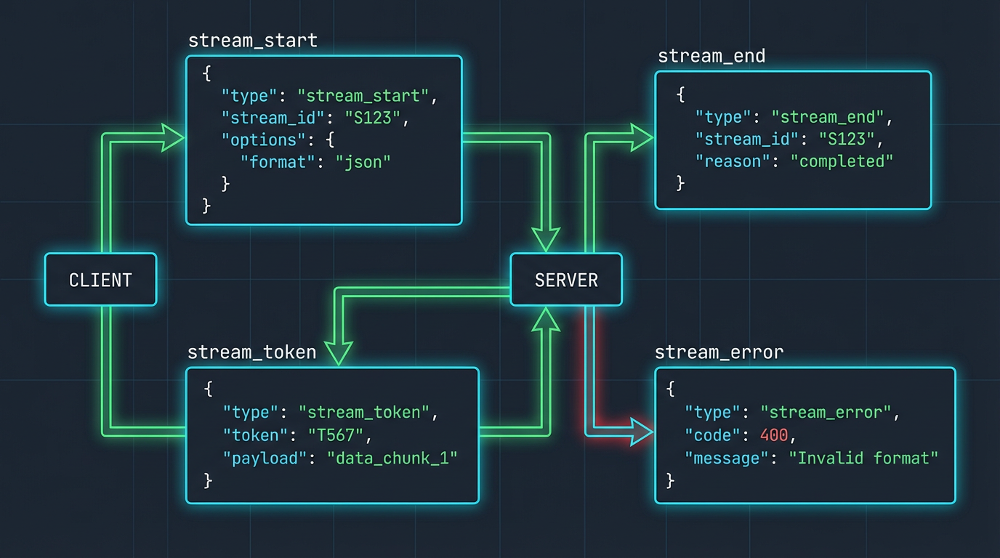
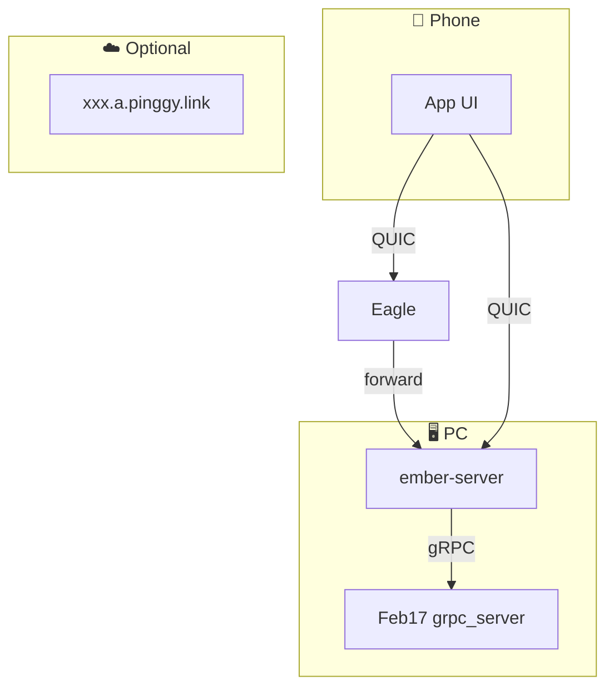
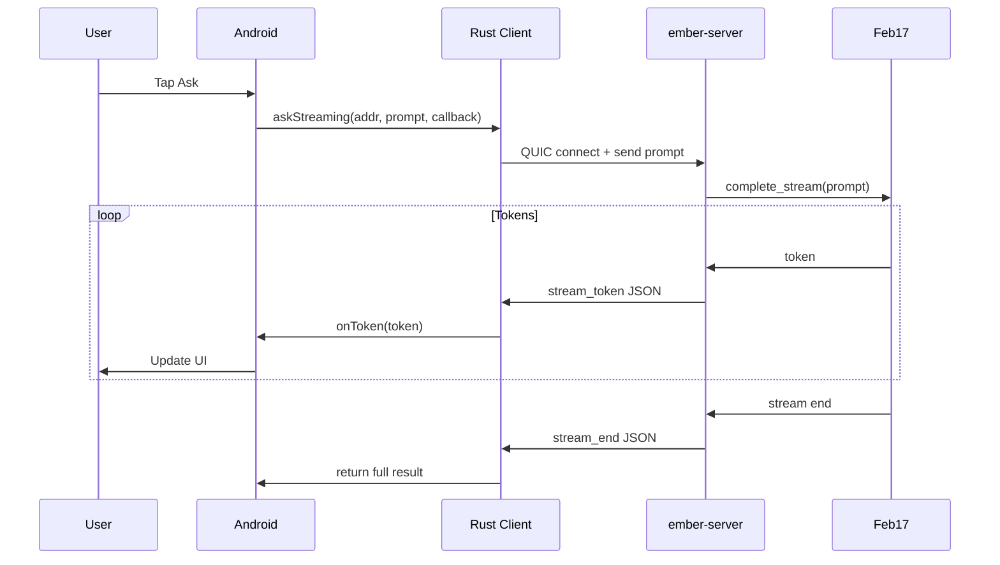
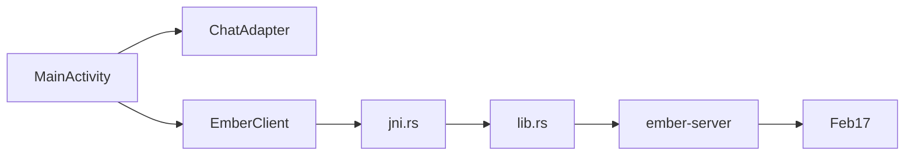

# Ember — Full Architecture & Functionality

A detailed explanation of the Ember project: a QUIC-based mobile AI chat client that connects to a local inference server via an optional reverse proxy (e.g. pinggy.io).

---

## 1. High-Level Overview

Ember lets you run an AI assistant on your home PC and access it from your smartphone over the internet. The phone app sends questions over QUIC (UDP), the ember-server bridges to a local gRPC inference service (Feb17), and responses stream back token-by-token.



---

## 2. End-to-End Request Flow



---

## 3. Network Architecture

**Scenario A (Local):** Phone on same WiFi → PC (ember-server :4433, Feb17 :50051)  
**Scenario B (Remote):** Phone → pinggy (e.g. xxx.a.pinggy.link:port) → PC



---

## 4. Component Diagram



| Layer | Components |
|-------|------------|
| **Android** | MainActivity, ChatAdapter, EmberClient, TokenCallback, SplashActivity |
| **Ember Client** | lib.rs (QUIC), jni.rs (JNI), parse_stream_response |
| **Ember Server** | main.rs, stream_inference, call_inference_stream |
| **Feb17** | grpc_server, complete_stream RPC |

---

## 5. Streaming Protocol (JSON Frames)

Frames are newline-delimited JSON objects (`\n`-terminated). Server → client.



**Frame types:** `stream_start`, `stream_token`, `stream_end`, `stream_error`  
**Client logic:** Read chunks, split on newline, parse JSON; `stream_token` → `on_token()`; `stream_end` → return; legacy: non-JSON lines treated as raw text.

---

## 6. Data Flow (Simplified)

```
┌─────────────────────────────────────────────────────────────────────────────────┐
│                    DATA FLOW                                                      │
└─────────────────────────────────────────────────────────────────────────────────┘

  REQUEST (Phone → Server):
  ─────────────────────────
  • User types prompt in EditText
  • MainActivity calls EmberClient.askStreaming(addr, prompt, callback)
  • JNI spawns thread; Rust connects QUIC, sends prompt as raw UTF-8 bytes
  • send.write_all(prompt.as_bytes()); send.finish()


  RESPONSE (Server → Phone):
  ─────────────────────────
  • ember-server receives prompt, calls Feb17 complete_stream
  • Feb17 streams tokens; ember-server wraps each in stream_token JSON
  • Client parse_stream_response reads chunks, parses JSON, calls on_token
  • JNI thread receives tokens via channel, calls callback.onToken(token)
  • MainActivity updates ChatAdapter; UI shows token progressively
```

---

## 7. File Layout

```
ember/
├── Cargo.toml                 # Workspace: server, client
├── client/
│   ├── Cargo.toml
│   └── src/
│       ├── lib.rs             # QUIC client, streaming
│       ├── main.rs            # Desktop CLI
│       ├── jni.rs             # Android JNI
│       └── ios.rs             # iOS bindings
├── server/
│   ├── Cargo.toml
│   ├── build.rs               # tonic-prost proto compile
│   ├── proto/llm.proto        # de.kherud.grpc.llm
│   └── src/main.rs            # QUIC bridge
├── android/
│   └── app/src/main/
│       ├── java/com/ember/android/
│       │   ├── MainActivity.kt
│       │   ├── EmberClient.kt
│       │   ├── ChatAdapter.kt
│       │   └── SplashActivity.kt
│       ├── jniLibs/           # libember_native.so (arm64, armv7)
│       └── res/values/
│           ├── server_defaults.xml   # Default server URL
│           └── strings.xml
├── inference_params.json     # Tune temp, top_p, mirostat, etc. (read per request)
├── build-android.ps1         # cargo ndk + gradle assembleRelease
├── release-android.ps1       # gh release create + APK upload
└── docs/
    ├── ARCHITECTURE.md        # This file
    └── DEVELOPMENT.md
```

---

## 8. Protocols & Ports

| Protocol | Port | Direction | Purpose |
|----------|------|-----------|---------|
| QUIC (UDP) | 4433 | Phone → ember-server | User prompts, streaming responses |
| gRPC (QUIC) | 50051 | ember-server → Feb17 | LLM inference |

---

## 9. Configuration Summary

| Item | Location | Default |
|------|----------|---------|
| ember-server listen | `server/src/main.rs` | `0.0.0.0:4433` |
| Feb17 gRPC | `--inference` | `https://127.0.0.1:50051` (QUIC) or `http://` (TCP) |
| Inference parameters | `inference_params.json` or `--params-file` | See [README](../README.md#fine-tuning-inference-parameters) |
| Android default server | `server_defaults.xml` | `xxx.a.pinggy.link:port` |
| Connection log | `--log-file` | `ember-connections.log` |

**Inference params:** The server reads `inference_params.json` on every request. Edit between messages to tune `temp`, `top_p`, `mirostat_tau`, etc. without restarting.

---

## 10. Startup Order

1. **Feb17 grpc_server** (QUIC 50051 with `--quic`, or TCP without).
2. **ember-server** (UDP 4433).
3. **Pinggy** tunnel (optional, for remote access): `pinggy.bat` exposes local 4433.
4. **Android app**: Connect using the URL from pinggy (e.g. `xxx.a.pinggy.link:port`) or local IP.

---

## 11. Mermaid Diagrams

### System Context



### Request Flow



### Component Dependencies


